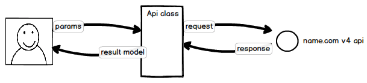

.. namecompy documentation master file, created by
   sphinx-quickstart on Sat Jun 30 17:30:40 2018.
   You can adapt this file completely to your liking, but it should at least
   contain the root `toctree` directive.

Overview
------------
*namecom* is a python library for the v4 api of `name.com <https://www.name.com>`_, a domain name registrar.

Installation
------------

If you haven't already, start by installing it
with *pip*::

   pip install --upgrade namecom

Quick Start
-----------

Use `DnsApi` to create a dns record:

.. sourcecode:: python

    from namecom import Auth, DnsApi

    auth = Auth('username', 'access_token')
    api = DnsApi(domainName='example.org', auth=auth)

    result = api.create_record(host='test', type='A', answer='10.0.0.1')

To access the service, an access token is required. You could find or generate one at
`API Token Manage Page <https://www.name.com/account/settings/api>`_:

.. sourcecode:: python

    >>> from namecom import Auth
    >>> auth = Auth('username', 'access_token')

When created, an api class accepts the :class:`~namecom.Auth` instance and use it to do the authentication:

.. sourcecode:: python

    >>> from namecom import DnsApi
    >>> api = DnsApi(domainName='example.org', auth=auth)

Let's find out how to create a dns record using python's built-in `help`:

.. sourcecode:: python

    >>> help(DnsApi)
    class DnsApi(_ApiBase)
    |  The api class for DNS. More details about each parameter :class:`here <namecom.Record>`.
    |  Official namecom documentation : https://www.name.com/api-docs/DNS
    |  ...
    |  create_record(self, host, type, answer, ttl=300, priority=None)
    |      Creates a new record in the zone.
    |
    |      Parameters
    |      ----------
    |      host : string
    |          hostname relative to the zone
    |      type : string
    |          dns record type
    |      answer : string
    |          dns record answer
    |      ttl : int
    |          dns record ttl
    |      priority : int
    |          dns record priority
    |
    |      Returns
    |      -------
    |      :class:`~namecom.result_models.CreateRecordResult`
    |          a response result instance with parsed response info

You can also see the :ref:`api-reference-label` for more details.
Now let's try this method:

.. sourcecode:: python

    >>> result = api.create_record(host='test', type='A', answer='10.0.0.1')

The result of api calls are strongly typed by result models. From the docstring above we know it's an instance of
`CreateRecordResult`. Let's see what's in this class:

.. sourcecode:: python

    >>> help(namecom.result_models.CreateRecordResult)
    class CreateRecordResult(RequestResult)
    |  Response class for CreateRecord method.
    |
    |  Attributes
    |  ----------
    |  record : :class:`~namecom.Record`
    |      instance of Record

It has a record attribute of type :class:`~namecom.Record` which contains the parsed response information:

.. sourcecode:: python

    >>> result.record
    Record(domainName='example.org', fqdn='test.example.org.', priority=None, host='test', ttl=300, answer='10.0.0.1', type='A', id=357756)

For most use cases, you can follow these steps to find out how to use it.

More About API
--------------

There are seven API in total:

* :class:`~namecom.DnsApi`
* :class:`~namecom.DnssecApi`
* :class:`~namecom.DomainApi`
* :class:`~namecom.EmailForwardingApi`
* :class:`~namecom.TransferApi`
* :class:`~namecom.URLForwardingApi`
* :class:`~namecom.VanityNameserverApi`

And there are two types of model:

* :ref:`Data Model <data-model-reference-label>` - represent entities for name.com api, like domain, dns record and email forwarding.
* :ref:`Result Model <result-model-reference-label>` - represent api response, contains data models and other fields like `nextPage` and `lastPage`.

The name of api method and its params are almost identical to the official name.com documentation.
When calling these methods, they will do the following things:

* construct and send request
* check response and throw error if necessary
* parse response into result model and return

More References
---------------

.. toctree::
   :maxdepth: 2
   :titlesonly:

   api
   data_model
   result_model
   exception

Usage Example
-------------
For more examples, test cases for the project illustrate how to interact with each api:

* `DnsApi <https://github.com/CtheSky/namecom/blob/master/tests/test_dns_api.py>`_
* `DnssecApi <https://github.com/CtheSky/namecom/blob/master/tests/test_dnssec_api.py>`_
* `DomainApi <https://github.com/CtheSky/namecom/blob/master/tests/test_domain_api.py>`_
* `EmailForwardingApi <https://github.com/CtheSky/namecom/blob/master/tests/test_emailforwarding_api.py>`_
* `TransferApi <https://github.com/CtheSky/namecom/blob/master/tests/test_transfer_api.py>`_
* `UrlForwardingApi <https://github.com/CtheSky/namecom/blob/master/tests/test_url_forwarding_api.py>`_
* `VanityNameserverApi <https://github.com/CtheSky/namecom/blob/master/tests/test_vanity_nameserver_api.py>`_

Hey, it's not Snake Case!
-------------------------
As you may have already noticed, some parameters of api method and data model attributes are not
snake case. I feel guilty if I don't explain, so here are the reasons:

* For people who want to use name.com api, they should already have read the official api doc.
  Keeping the same name convention from official doc would made it more consistent and nature to use.
* Keeping names consistent with official api brings convenience when parsing response and building request.

And I feel even less guilty after reading `PEP8 <https://www.python.org/dev/peps/pep-0008/>`_:

   mixedCase is allowed only in contexts where that's already the prevailing style

Indices and tables
==================

* :ref:`genindex`
* :ref:`modindex`
* :ref:`search`
